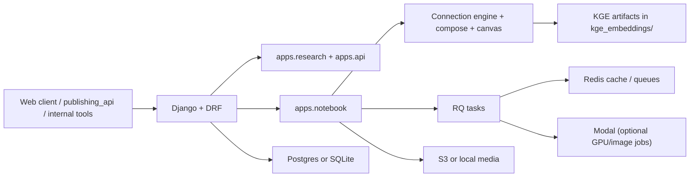

# Research_API

`research_api` is the Django backend for two related systems:

1. The public research layer behind `travisgilbert.me`
2. The CommonPlace notebook and knowledge-graph workspace

The codebase exposes a read-oriented research API, a write-oriented notebook API,
an asynchronous capture and ingestion pipeline, and a multi-pass connection
engine that turns captured material into a structured graph.

This README is based on the current code, not the historical Claude-era build
docs or earlier plugin specs.

## What This Repo Does

- Stores and serves research sources, research threads, backlinks, mentions, and search results
- Powers CommonPlace notebook capture, graph views, timeline views, compose-mode discovery, and data-canvas suggestions
- Runs a layered connection engine over notebook Objects
- Supports local full-NLP mode and production-safe degraded mode from the same codebase
- Uses Redis-backed queues for engine and ingestion jobs
- Can offload heavy image analysis to Modal

## High-Level Architecture



## Application Map

| App | Role |
| --- | --- |
| `apps.core` | User model and shared base types |
| `apps.research` | Research sources, threads, clustering, search, graph, temporal views |
| `apps.api` | Public and internal API endpoints layered over research data |
| `apps.notebook` | CommonPlace notebook domain, connection engine, capture, graph, compose, canvas, export |
| `apps.comments` | Public comment endpoints |
| `apps.mentions` | Webhooks and webmention jobs |
| `apps.publisher` | Publishing-related integration surfaces |
| `apps.paper_trail` | Site-facing routes mounted at `/` |

## Core Notebook Model

CommonPlace uses an object-centric knowledge graph:

- `Object`: the primary unit of captured knowledge
- `ObjectType`: note, source, person, place, concept, and other typed variants
- `Component`: typed structured data attached to an `Object`
- `Edge`: a relationship between two `Object`s with a plain-English reason
- `Node`: immutable timeline event
- `Notebook`: a scoped workspace with engine configuration
- `Project`: goal-oriented grouping
- `Timeline`: ordered event stream
- `Cluster`: persisted community-detection result
- `Claim`: sentence-sized proposition extracted from an `Object`

The most important model file is `apps/notebook/models.py`.

## API Surface

### Root routes

- `/api/v1/` -> public research API
- `/api/v1/notebook/` -> CommonPlace notebook API
- `/api/comments/` -> comment endpoints
- `/webhooks/` -> mention/webhook endpoints
- `/health/` -> health check for DB and cache

### Research API examples

- `/api/v1/trail/<slug>/`
- `/api/v1/sources/`
- `/api/v1/threads/`
- `/api/v1/search/`
- `/api/v1/tensions/`
- `/api/v1/clusters/`
- `/api/v1/internal/promote/`

### Notebook API examples

- `/api/v1/notebook/objects/`
- `/api/v1/notebook/capture/`
- `/api/v1/notebook/feed/`
- `/api/v1/notebook/graph/`
- `/api/v1/notebook/resurface/`
- `/api/v1/notebook/compose/related/`
- `/api/v1/notebook/canvas/suggest/`
- `/api/v1/notebook/self-organize/run/`
- `/api/v1/notebook/self-organize/jobs/<job_id>/`
- `/api/v1/notebook/self-organize/latest/`
- `/api/v1/notebook/self-organize/preview/`
- `/api/v1/notebook/self-organize/emergent-types/`
- `/api/v1/notebook/self-organize/emergent-types/apply/`
- `/api/v1/notebook/export/`

Report endpoint formats:
- JSON (default): `/api/v1/notebook/report/`
- Markdown: `/api/v1/notebook/report/?format=markdown`

CLI export:
- `python manage.py export_organization_report --format json`
- `python manage.py export_organization_report --format markdown --notebook <slug>`

## Connection Engine

The notebook engine lives in `apps/notebook/engine.py`. It is a post-capture,
graph-enrichment system that creates `Edge` records and timeline nodes.

### Engine passes

1. Adaptive NER
   Uses spaCy plus graph-learned phrase matching from existing Objects
2. Shared entity linking
   Connects Objects that mention the same resolved entities
3. BM25 lexical retrieval
   Replaces the older Jaccard and TF-IDF split passes as the main lexical layer
4. Instruction-tuned SBERT
   Uses task-aware query/document encoding with FAISS-backed retrieval when available
5. Claim-level NLI
   Decomposes Objects into claims and creates `supports` and `contradicts` edges from claim pairs
6. Temporal KGE
   Adds trend-aware structural matches from time-bucketed KGE profiles and can emit `engine='kge_temporal'`
7. Causal lineage
   Builds forward-in-time influence edges from support-style claim transfer

### Post-pass intelligence

- Community detection in `apps/notebook/community.py`
- Structural gap analysis in `apps/notebook/gap_analysis.py`
- Temporal graph snapshots in `apps/notebook/temporal_evolution.py`
- Cluster summaries in `apps/notebook/synthesis.py`

### Compose mode

`apps/notebook/compose_engine.py` is the live-query sidecar for writing-time
discovery. It uses ordered, degradable passes and returns scored candidates plus
pass-state metadata for the UI.

### Data canvas

`apps/notebook/canvas_engine.py` extracts notebook data and builds Vega-Lite
specs through Altair. The frontend is a thin renderer.

## Runtime Modes

The repo supports two practical deployment modes from the same codebase.

### Production / Railway

- Uses `requirements/production.txt`
- Does not require PyTorch, sentence-transformers, or FAISS
- Keeps the notebook usable through spaCy, BM25, and other production-safe paths
- Runs web plus worker processes via Gunicorn and `rqworker`

### Local / Development

- Uses `requirements/local.txt` or `requirements/development.txt`
- Enables PyTorch, sentence-transformers, FAISS, and the full notebook engine
- Supports training/loading KGE artifacts and testing the advanced NLP paths

### Modal

Modal is optional. When configured, heavy image analysis can be offloaded from
the ingestion queue.

## Background Jobs

`apps/notebook/tasks.py` defines three queue families:

- `engine` -> connection-engine runs
- `ingestion` -> heavy file enrichment and image analysis
- `default` -> utility work such as FAISS rebuilds and notifications

The service layer in `apps/notebook/services.py` dispatches to RQ first and
falls back inline if queue dispatch is unavailable.

## Storage and Infrastructure

### Database

- PostgreSQL when `DATABASE_URL` is set
- SQLite fallback for local development

### Cache and queues

- Redis when `REDIS_URL` is set
- in-memory cache fallback when Redis is absent

### File storage

- S3-compatible storage when AWS credentials are present
- local `media/` fallback otherwise

### KGE artifacts

Temporal and static graph-embedding artifacts live in `kge_embeddings/` and are
loaded by `apps/notebook/vector_store.py`.

## Important Files and Modules

| Path | Purpose |
| --- | --- |
| `config/settings.py` | environment-driven Django configuration |
| `config/urls.py` | root routing and health check |
| `apps/notebook/models.py` | CommonPlace domain model |
| `apps/notebook/engine.py` | connection engine |
| `apps/notebook/compose_engine.py` | live compose query engine |
| `apps/notebook/canvas_engine.py` | visualization-spec generation |
| `apps/notebook/services.py` | capture and orchestration layer |
| `apps/notebook/tasks.py` | RQ background jobs |
| `apps/notebook/vector_store.py` | FAISS and KGE loading/querying |
| `apps/research/advanced_nlp.py` | SBERT and NLI loading/inference |
| `apps/notebook/community.py` | Louvain community detection |
| `apps/notebook/gap_analysis.py` | structural-gap detection |
| `apps/notebook/temporal_evolution.py` | sliding-window graph analysis |
| `apps/notebook/synthesis.py` | cluster summaries |
| `scripts/train_kge.py` | offline KGE training and temporal-profile export |

## Local Setup

### 1. Create a virtual environment

```bash
python3 -m venv .venv
source .venv/bin/activate
```

### 2. Install dependencies

Full local NLP stack:

```bash
pip install -r requirements/local.txt
```

Development extras:

```bash
pip install -r requirements/development.txt
```

Production-like install without PyTorch:

```bash
pip install -r requirements/production.txt
```

### 3. Configure environment

```bash
cp .env.example .env
```

Then fill in the keys you actually need. The repo works with a minimal local
configuration, but some features require:

- `DATABASE_URL` for PostgreSQL
- `REDIS_URL` for Redis cache/RQ
- `AWS_*` vars for S3 storage
- `ANTHROPIC_API_KEY` for optional LLM explanations and synthesis
- `MODAL_TOKEN_ID` and `MODAL_TOKEN_SECRET` for Modal image analysis

### 4. Migrate and seed notebook defaults

```bash
python manage.py migrate
python manage.py seed_object_types
python manage.py seed_component_types
python manage.py seed_node_types
python manage.py seed_commonplace
```

Optional sample data:

```bash
python manage.py create_sample_data
```

### 5. Run the web app

```bash
python manage.py runserver 8001
```

### 6. Run the worker

```bash
python manage.py rqworker default engine ingestion --with-scheduler
```

## Common Operational Commands

### Run tests

```bash
python3 manage.py test apps.notebook apps.research --verbosity 2
```

### Run the notebook engine over Objects

```bash
python manage.py run_connection_engine
python manage.py run_connection_engine --notebook <slug>
```

### Detect and persist communities

```bash
python manage.py detect_communities --persist
python manage.py detect_communities --notebook <slug> --resolution 1.0 --persist
```

### Export graph triples and train KGE artifacts

```bash
python manage.py export_kge_triples
python scripts/train_kge.py --input-dir kge_embeddings --output-dir kge_embeddings
```

### Rebuild search index

```bash
python manage.py rebuild_search_index
```

## Deployment Notes

### Railway

`railway.toml` starts the web server, runs migrations, collects static files,
ensures a superuser, and starts an RQ worker in the same container.

For higher scale, split the worker into a separate service. The included
`Procfile` already models separate `web` and `worker` roles.

### Docker-based Railway setup (recommended for deterministic builds)

This repo now includes:

- `Dockerfile.web` -> Django + gunicorn web service
- `Dockerfile.worker` -> RQ worker service (`default`, `engine`, `ingestion`)
- `.dockerignore` -> keeps images lean

Suggested Railway service configuration:

1. Web service
- `RAILWAY_DOCKERFILE_PATH=research_api/Dockerfile.web`
- Start command:
  `python manage.py migrate --noinput && python manage.py collectstatic --noinput && gunicorn config.wsgi --bind 0.0.0.0:$PORT --workers 2 --access-logfile - --error-logfile -`

2. Worker service
- `RAILWAY_DOCKERFILE_PATH=research_api/Dockerfile.worker`
- Start command:
  `python manage.py rqworker default engine ingestion --with-scheduler`

3. Enable nightly self-organization (worker env)
- `ENABLE_SELF_ORGANIZE_SCHEDULER=true`
- Optional schedule override (UTC):
  `SELF_ORGANIZE_SCHEDULE_HOUR_UTC=3`
  `SELF_ORGANIZE_SCHEDULE_MINUTE_UTC=0`
- Run once:
  `python manage.py ensure_reorganize_schedule --force`

4. Smoke validation
- Local/CI runtime smoke script:
  `./scripts/smoke_deploy.sh`
- CI Docker + runtime smoke workflow:
  `.github/workflows/research-api-docker-smoke.yml`

### Static files and uploads

- Static files use WhiteNoise
- Uploaded files use S3 when configured, local storage otherwise

## Environment Variables

Commonly used variables from `.env.example` and `config/settings.py`:

- `SECRET_KEY`
- `DEBUG`
- `ALLOWED_HOSTS`
- `DATABASE_URL`
- `REDIS_URL`
- `AWS_ACCESS_KEY_ID`
- `AWS_SECRET_ACCESS_KEY`
- `AWS_STORAGE_BUCKET_NAME`
- `AWS_S3_REGION_NAME`
- `GITHUB_TOKEN`
- `GITHUB_REPO`
- `GITHUB_BRANCH`
- `WEBMENTION_TARGET_DOMAIN`
- `INTERNAL_API_KEY`
- `RECAPTCHA_SECRET_KEY`
- `MODAL_TOKEN_ID`
- `MODAL_TOKEN_SECRET`
- `ANTHROPIC_API_KEY`
- `ENABLE_SELF_ORGANIZE_SCHEDULER`
- `SELF_ORGANIZE_SCHEDULE_HOUR_UTC`
- `SELF_ORGANIZE_SCHEDULE_MINUTE_UTC`

## Testing and Validation

Current notebook and research coverage includes:

- compose-engine behavior
- notebook capture and export
- community detection and gap analysis
- instruction-aware SBERT behavior
- claim decomposition and claim-level NLI
- temporal KGE trend detection
- causal lineage
- temporal evolution snapshots
- cluster synthesis fallback behavior

## Project Docs

For repo-operating guidance and current engi


The following files are useful as historical context but are not the current
source of truth:


Current truth lives in the code and in the lightweight docs under `docs/`.
